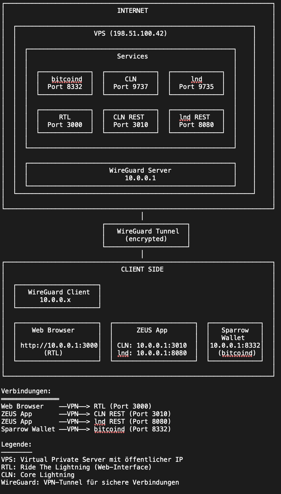

# SlimNode - Set up minimalistic Bitcoin and Lightning node in a few steps

This guide explains how to set up a Bitcoin and a Lightning node on a VPS (Virtual Private Server), 
but it should also work on a Raspberry Pi or any other Ubuntu Linux installation.

A (german) tutorial video how to install your node can be found on YouTube:
[](https://www.youtube.com/watch?v=0aCzCE4nImc)


I did this project, because I wanted to get rid of my Raspberry Pi at home. It's shaky hardware and 
I encountered quite some fails due to errors on the hard disk resulting in a broken blockchain, so I had 
to download everything again - which can take several weeks, especially if you do it via Tor. Also, I wasn't
happy with most node distributions, which can be tricky to debug, if you run into problems, e.g. synchronisation
stops. Also, the load on my Raspberry Pis was usually very high due to status scripts that run every
few seconds to display information about the blockchain, the channel count etc.. This data is only
interesting every now and then, so no need to stress the system all the time. SlimNode is the opposite
to rich menu-driven node distributions, I tried to keep the system simple and clean, and easy to debug,
with log files in obvious places and not spread across multiple mount points. 

Turns out: You can run a Bitcoin node and two Lightning nodes on the same tiny VPS without problems, if
you cut out the noise (unless you open a vast amount of channels).

Originally, I wrote a script to make the installation process more convenient, but in the end, writing the script ended up being more effort than the actual installation itself. Also I didn't want to create another node distribution (that nobody uses), That’s why I  am listing the plain shell commands necessary for the installation, to be easily copied and pasted into a terminal window.

The following components will be installed:

* bitcoind (Pruned Bitcoin core)
* lightningd (Core Lightning - CLN)
* lnd (Lightning Network Daemon)
* RTL (Ride The Lightning)
* VPN access via WireGuard

There are plenty of VPS providers out there, for about $5/month you can rent a VPS that’s more than
enough for our purpose. Look for specs like these:

    8 GB RAM
    100+ GB Disk Storage
    Ubuntu 24.04

6 GB of RAM is fine too, but you shouldn’t go much lower than 80 GB of storage. Ubuntu 24.04
is mandatory, this guide was only tested with this version. Also, it is assumed the primary network
device is ```eth0```.

To connect via WireGuard, you need the WireGuard app on your phone and on your workstation.

# Target System



# Installation

When you rented your VPS, you'll also get a public IP address of your server. You should also have set up
a root password in the provider’s web interface and optionally added some SSH keys already.

__At this point you should now be logged into your VPS as root.__

# Step 1: Install packages, create bitcoin user, set up firewall, create SSH keys, install bitcoind

During the process, check if the package signatures of bitcoind are ok. 

```console
PUBLIC_IP=`ip addr show eth0 | grep 'inet ' | awk '{print $2}' | cut -f1 -d'/'`
BITCOIND_VERSION="28.1"
LND_VERSION="v0.20.1-beta"
CLN_VERSION="v25.09.3"
BITCOIND_PW=`cat /dev/urandom | LC_ALL=C tr -dc 'a-zA-Z0-9' | fold -w 50 | head -n 1`
BITCOIN_USER_PW=`cat /dev/urandom | LC_ALL=C tr -dc 'a-zA-Z0-9' | fold -w 50 | head -n 1`
RTL_PW=`cat /dev/urandom | LC_ALL=C tr -dc 'a-zA-Z0-9' | fold -w 50 | head -n 1`
BITCOIN_USER_HOME=/home/bitcoin
WG_NODE_IP="10.0.0.1"
PRUNE_MB="30000"
NVM_VERSION="v0.40.3"
RTL_VERSION="v0.15.5"
apt update 
apt upgrade -y
apt install -y btop python3-poetry python3-json5 jq pipx ufw htop iptraf fail2ban npm tor autoconf automake build-essential git libtool libsqlite3-dev libffi-dev python3 python3-pip net-tools zlib1g-dev libsodium-dev gettext python3-mako git automake autoconf-archive libtool build-essential pkg-config libev-dev libcurl4-gnutls-dev libsqlite3-dev python3-venv wireguard python3-flask python3-gunicorn python3-gevent python3-websockets python3-flask-cors python3-flask-socketio python3-gevent-websocket python3-grpcio python3-grpc-tools python3-psutil ripgrep golang-go python3-json5 qrencode multitail cargo rustfmt protobuf-compiler lowdown

useradd -m bitcoin -s /bin/bash
adduser bitcoin sudo
usermod -a -G debian-tor bitcoin
echo "bitcoin:${BITCOIN_USER_PW}" | chpasswd
ufw default allow outgoing
ufw allow 51820/udp 
ufw allow ssh
ufw allow 9735,9737/tcp
ufw allow proto tcp from 10.0.0.0/24 to 10.0.0.0/24 port 22,3000,3010,8080,8332
ufw logging off 
ufw --force enable
systemctl enable ufw  
sudo -u bitcoin sh -c "ssh-keygen -t rsa -b 4096 -f /home/bitcoin/.ssh/id_rsa -P ''"
tee /etc/profile.d/aliases.sh <<EOF
alias nodelogs="multitail /home/bitcoin/.bitcoin/debug.log /home/bitcoin/.lightning/bitcoin/cl.log /home/bitcoin/.lnd/logs/bitcoin/mainnet/lnd.log"
EOF

sudo -u bitcoin sh -c "wget https://bitcoin.org/bin/bitcoin-core-${BITCOIND_VERSION}/bitcoin-${BITCOIND_VERSION}-x86_64-linux-gnu.tar.gz -P ~"
sudo -u bitcoin sh -c "wget https://bitcoin.org/bin/bitcoin-core-${BITCOIND_VERSION}/SHA256SUMS -P ~"
sudo -u bitcoin sh -c "wget https://bitcoin.org/bin/bitcoin-core-${BITCOIND_VERSION}/SHA256SUMS.asc -P ~"
sudo -u bitcoin sh -c "cd && sha256sum --ignore-missing --check ~/SHA256SUMS"
sudo -u bitcoin sh -c 'curl -s "https://api.github.com/repositories/355107265/contents/builder-keys" | grep download_url | grep -oE "https://[a-zA-Z0-9./-]+" | while read url; do curl -s "$url" | gpg --import; done'
sudo -u bitcoin sh -c "gpg --verify ~/SHA256SUMS.asc"
sudo -u bitcoin sh -c "tar -xvf ~/bitcoin-${BITCOIND_VERSION}-x86_64-linux-gnu.tar.gz -C ~"
sudo -u bitcoin sh -c "echo ${BITCOIN_USER_PW} | sudo -S install -m 0755 -o root -g root -t /usr/local/bin ~/bitcoin-${BITCOIND_VERSION}/bin/*"  
sudo -u bitcoin sh -c "mkdir -p ~/.bitcoin"
sudo -u bitcoin sh -c "tee >~/.bitcoin/bitcoin.conf <<EOF
daemon=1
server=1
prune=${PRUNE_MB}
onion=127.0.0.1:9050
listen=1
walletbroadcast=0
rpcbind=0.0.0.0:8332
rpcallowip=0.0.0.0/0
whitelist=0.0.0.0/0
rpcuser=bitcoin
rpcpassword=${BITCOIND_PW}
zmqpubrawblock=tcp://127.0.0.1:28332
zmqpubrawtx=tcp://127.0.0.1:28333
EOF"
sudo sh -c "tee  /etc/systemd/system/bitcoind.service <<EOF
[Unit]
Description=Bitcoin daemon

[Service]
User=bitcoin
Group=bitcoin
Type=forking
PIDFile=/home/bitcoin/.bitcoin/bitcoind.pid
ExecStart=/usr/local/bin/bitcoind -pid=/home/bitcoin/.bitcoin/bitcoind.pid
KillMode=process
TimeoutSec=120

[Install]
WantedBy=multi-user.target
EOF"
systemctl enable bitcoind.service
```


### Step 2a: Install Core Lightning (CLN)

```console
sudo -u bitcoin sh -c "mkdir -p ~/.lightning/bitcoin/backups/"
sudo -u bitcoin sh -c "git clone https://github.com/ElementsProject/lightning.git ~/lightning && cd ~/lightning && git checkout ${CLN_VERSION}"
sudo -u bitcoin sh -c "curl -LsSf https://astral.sh/uv/install.sh | sh"


#sudo -u bitcoin sh -c "cd ~/lightning && poetry install && ./configure && poetry run make -j`nproc --all` && echo ${BITCOIN_USER_PW} | sudo -S make install"
sudo -u bitcoin sh -c "export PATH=/home/bitcoin/.local/bin:${PATH} && cd ~/lightning && uv sync --all-extras --all-groups --frozen && ./configure && sed -i '/version = 4/c\version = 3' Cargo.lock && RUST_PROFILE=release uv run make  && echo ${BITCOIN_USER_PW} | sudo -S RUST_PROFILE=release make install"
PIP_OPTIONS="--break-system-packages"
sudo -u bitcoin sh -c "pip3 install --user pyln-client websockets flask-cors flask-restx pyln-client flask-socketio gevent gevent-websocket ${PIP_OPTIONS}"
sudo -u bitcoin sh -c 'tee ~/.lightning/config <<EOF
network=bitcoin
log-file=cl.log
clnrest-host=0.0.0.0
clnrest-port=3010
#important-plugin=/home/bitcoin/plugins/backup/backup.py
#wallet=sqlite3:///home/bitcoin/.lightning/bitcoin/lightningd.sqlite3:/home/bitcoin/.lightning/bitcoin/backups/lightningd.sqlite3
wallet=sqlite3:///home/bitcoin/.lightning/bitcoin/lightningd.sqlite3
bitcoin-retry-timeout=3600
proxy=127.0.0.1:9050
bind-addr=127.0.01:9737
rpc-file-mode=0664
bitcoin-rpcuser=bitcoin
bitcoin-rpcport=8332
bitcoin-rpcconnect=127.0.0.1
bitcoin-rpcpassword='${BITCOIND_PW}'
bind-addr='${PUBLIC_IP}':9737
announce-addr='${PUBLIC_IP}':9737
EOF'

# Commented out til fixed
#sudo -u bitcoin sh -c "git clone https://github.com/lightningd/plugins.git ~/plugins"
#sudo -u bitcoin sh -c "export PATH=/home/bitcoin/.local/bin:${PATH} && cd ~/plugins/backup && poetry install && poetry run ./#backup-cli init --lightning-dir /home/bitcoin/.lightning/bitcoin file:///home/bitcoin/.lightning/bitcoin/backups/lightningd.sqlite3.bkp"
sudo sh -c "tee /etc/systemd/system/lightningd.service <<EOF
[Unit]
Description=c-lightning daemon on mainnet
After=bitcoind.service

[Service]
ExecStart=/usr/local/bin/lightningd --conf=/home/bitcoin/.lightning/config  --pid-file=/run/lightningd/lightningd.pid
RuntimeDirectory=lightningd
User=bitcoin
Group=bitcoin
Type=simple
PIDFile=/run/lightningd/lightningd.pid
TimeoutSec=60
PrivateTmp=true
ProtectSystem=full
NoNewPrivileges=true
PrivateDevices=true
MemoryDenyWriteExecute=true

[Install]
WantedBy=multi-user.target
EOF"
mkdir -p /run/lightningd/
chown bitcoin:bitcoin /run/lightningd/
chmod 755 /run/lightningd/
systemctl start bitcoind.service
systemctl enable lightningd.service
systemctl start lightningd.service

# maintenance tasks
sudo tee /etc/cron.hourly/backuptasks <<EOF
#!/bin/sh
rsync -av /home/bitcoin/.lightning/bitcoin/emergency.recover /home/bitcoin/.lightning/bitcoin/backups/emergency.recover.bak
rsync -av /home/bitcoin/.lightning/bitcoin/hsm_secret /home/bitcoin/.lightning/bitcoin/backups/hsm_secret.bak
EOF
chmod 755 /etc/cron.hourly/backuptasks
echo "55 4    * * *   bitcoin lightning-cli backup-compact"  >>/etc/crontab
systemctl restart cron.service
```

### Step 2b: Install lnd

```console
sudo -u bitcoin sh -c "mkdir ~/.lnd"
sudo -u bitcoin sh -c "wget https://github.com/lightningnetwork/lnd/releases/download/${LND_VERSION}/lnd-linux-386-${LND_VERSION}.tar.gz -P ~"
sudo -u bitcoin sh -c "tar -xvf ~/lnd-linux-386-${LND_VERSION}.tar.gz -C ~"
sudo -u bitcoin sh -c "ln -s ~/lnd-linux-386-${LND_VERSION} ~/lnd"
sudo -u bitcoin sh -c 'tee  ~/.lnd/lnd.conf <<EOF
[Application Options]
listen='${PUBLIC_IP}':9735
externalip='${PUBLIC_IP}':9735
restlisten=0.0.0.0:8080

[Bitcoin]
bitcoin.mainnet=true
bitcoin.node=bitcoind
EOF'
sudo sh -c "tee  /etc/systemd/system/lnd.service <<EOF
[Unit]
Description=lnd

[Service]
User=bitcoin
Group=bitcoin
Type=simple
ExecStart=/home/bitcoin/lnd/lnd --externalip=${PUBLIC_IP}
PIDFile=/home/bitcoin/.lnd/lnd.pid
KillMode=process
TimeoutSec=60

[Install]
WantedBy=multi-user.target
EOF"


sudo -u bitcoin sh -c 'tee >>~/.profile <<EOF 
# set PATH to include lnd binaries
if [ -d "$HOME/lnd" ] ; then
  PATH="$HOME/lnd:$PATH"
fi
'
systemctl enable lnd.service
systemctl start lnd.service
```


# Step 3: Install RTL

```console
sudo -u bitcoin sh -c "PROFILE=/dev/null curl -o- https://raw.githubusercontent.com/nvm-sh/nvm/${NVM_VERSION}/install.sh | bash"
sudo -u bitcoin sh -c 'tee >>~/.profile <<EOF
export NVM_DIR="$([ -z "${XDG_CONFIG_HOME-}" ] && printf %s "${HOME}/.nvm" || printf %s "${XDG_CONFIG_HOME}/nvm")"
[ -s "$NVM_DIR/nvm.sh" ] && \. "$NVM_DIR/nvm.sh" # This loads nvm
EOF'
sudo -u bitcoin sh -c "export NVM_DIR='${BITCOIN_USER_HOME}/.nvm' ; . ${BITCOIN_USER_HOME}/.nvm/nvm.sh && nvm install node"
sudo -u bitcoin sh -c "rm -rf ${BITCOIN_USER_HOME}/RTL"
sudo -u bitcoin sh -c "export NVM_DIR='${BITCOIN_USER_HOME}/.nvm' ; . ${BITCOIN_USER_HOME}/.nvm/nvm.sh; git clone https://github.com/Ride-The-Lightning/RTL.git ~/RTL && cd ~/RTL && git checkout ${RTL_VERSION} && npm install --omit=dev --legacy-peer-deps" 
sudo -u bitcoin sh -c 'tee ~/RTL/RTL-Config.json <<EOF
{
  "port": "3000",
  "defaultNodeIndex": 1,
  "dbDirectoryPath": "/home/bitcoin/RTL/",
  "SSO": {
    "rtlSSO": 0,
    "rtlCookiePath": "",
    "logoutRedirectLink": ""
  },
  "nodes": [
    {
      "index": 2,
      "lnNode": "Core Lightning",
      "lnImplementation": "CLN",
      "authentication": {
        "runePath": "/home/bitcoin/RTL/rune.txt"
      },
      "settings": {
        "userPersona": "OPERATOR",
        "themeMode": "DAY",
        "themeColor": "PURPLE",
        "logLevel": "INFO",
        "lnServerUrl": "https://127.0.0.1:3010",
        "fiatConversion": false,
        "unannouncedChannels": false,
        "blockExplorerUrl": "https://mempool.space"
      }
    },
    {
      "index": 1,
      "lnNode": "lnd",
      "lnImplementation": "LND",
      "authentication": {
        "macaroonPath": "/home/bitcoin/.lnd/data/chain/bitcoin/mainnet"
      },
      "settings": {
        "userPersona": "OPERATOR",
        "themeMode": "DAY",
        "themeColor": "PURPLE",
        "logLevel": "INFO",
        "lnServerUrl": "https://127.0.0.1:8080",
        "fiatConversion": false,
        "unannouncedChannels": false,
        "blockExplorerUrl": "https://mempool.space"
      }
    }
  ],
  "multiPass": "'"${RTL_PW}"'"
}
EOF'
sudo sh -c "tee /etc/systemd/system/rtl.service <<EOF
[Unit]
Description=Ride The Lightning
After=bitcoind.service lightningd.service

[Service]
User=bitcoin
Group=bitcoin
WorkingDirectory=/home/bitcoin/RTL
ExecStart=node rtl
Type=simple

[Install]
WantedBy=multi-user.target
EOF"
RUNE=`sudo -u bitcoin sh -c "lightning-cli createrune | jq .rune"`
sudo -u bitcoin sh -c "echo LIGHTNING_RUNE='${RUNE}' >~/RTL/rune.txt"
sudo systemctl enable rtl.service
```

# Step 4: Configure Wireguard

```console

wg genkey | sudo tee /etc/wireguard/private.key && chmod go= /etc/wireguard/private.key && cat /etc/wireguard/private.key | wg pubkey | tee /etc/wireguard/public.key
WG_NODE_PRIV_KEY=`cat /etc/wireguard/private.key` 
WG_NODE_PUB_KEY=`cat /etc/wireguard/public.key` 
WG_PHONE_PRIV_KEY=`wg genkey`
echo "net.ipv4.ip_forward=1" >>/etc/sysctl.conf
sysctl -p
systemctl enable wg-quick@wg0 && systemctl restart wg-quick@wg0 && wg show
tee /tmp/phone.conf <<EOF
[Interface]
PrivateKey = ${WG_PHONE_PRIV_KEY}
Address = 10.0.0.11/24

# VPS
[Peer]
PublicKey = ${WG_NODE_PUB_KEY}
AllowedIPs = ${WG_NODE_IP}/32
Endpoint = ${PUBLIC_IP}:51820
PersistentKeepalive = 15
EOF
echo "On your phone, scan this Wireguard QR Code:"
qrencode -t ansiutf8 < /tmp/phone.conf
echo -e "On your workstation, your wireguard configuration should be as follows:"
echo -e "[Interface]\nPrivateKey = <Generated by wireguard>\nAddress = 10.0.0.12/24\n\n# VPS\n[Peer]\nPublicKey = ${WG_NODE_PUB_KEY}\nAllowedIPs = ${WG_NODE_IP}/32\nEndpoint = ${PUBLIC_IP}:51820\n"
read -p "Enter wireguard public key from your phone: " PUBKEY_PHONE
read -p "Enter wireguard public key from your work station: " PUBKEY_WORKSTATION
tee /etc/wireguard/wg0.conf <<EOF
[Interface]
Address = ${WG_NODE_IP}/24
ListenPort = 51820
PrivateKey = ${WG_NODE_PRIV_KEY}

PostUp = ufw route allow in on wg0 out on eth0
PostUp = iptables -t nat -I POSTROUTING -o eth0 -j MASQUERADE
PostUp = ip6tables -t nat -I POSTROUTING -o eth0 -j MASQUERADE
PreDown = ufw route delete allow in on wg0 out on eth0
PreDown = iptables -t nat -D POSTROUTING -o eth0 -j MASQUERADE
PreDown = ip6tables -t nat -D POSTROUTING -o eth0 -j MASQUERADE

# Phone
[Peer]
PublicKey = ${PUBKEY_PHONE}
AllowedIPs = 10.0.0.11/32
PersistentKeepalive = 15

# Workstation
[Peer]
PublicKey = ${PUBKEY_WORKSTATION}
AllowedIPs = 10.0.0.12/32
EOF
```

# Finalization

Here we'll create the lnd wallet, print out the configuration data and reboot the VPS.

__Remember to save the lnd wallet password and write down the seed phrase.__


```console
sudo -u bitcoin sh -c "/home/bitcoin/lnd/lncli create"
echo "================================================================="
echo -e "===================== \033[1mInstallation finished\033[0m ====================="
echo "================================================================="
echo " Wireguard configuration"
echo "================================================================="
echo "Workstation"
echo "-----------------------------------------------------------------"
echo -e "[Interface]\nPrivateKey = <Generated by wireguard>\nAddress = 10.0.0.12/24\n\n# VPS\n[Peer]\nPublicKey = ${WG_NODE_PUB_KEY}\nAllowedIPs = ${WG_NODE_IP}/32\nEndpoint = ${PUBLIC_IP}:51820\n"
echo "=================================================================="
echo " ZEUS Wallet Connection data "
echo "================================================================="
echo "Setup for Core Lightning (CLN)"
echo "-----------------------------------------------------------------"
echo "   -> Wallet Interface: Core Lightning (CLNRest)"
echo "   -> Server address: ${WG_NODE_IP}"
echo "   -> REST Port: 3010"
_RUNE=`. /home/bitcoin/RTL/rune.txt && echo $LIGHTNING_RUNE`
echo "   -> Rune: ${_RUNE}"
echo "-----------------------------------------------------------------"
echo "Setup for lnd"
echo "-----------------------------------------------------------------"
echo "  -> Wallet Interface: LND (REST)"
echo "  -> Server address: ${WG_NODE_IP}"
echo "  -> REST Port: 8080"
_MACAROON=`hexdump -ve '1/1 "%.2x"' /home/bitcoin/.lnd/data/chain/bitcoin/mainnet/admin.macaroon`
echo "  -> Macaroon (Hex Format): ${_MACAROON}"
echo "================================================================="
echo "Ride The Lightning (RTL)"
echo "================================================================="
echo "  -> http://${WG_NODE_IP}:3000"
echo "  -> Password: ${RTL_PW}"
echo "================================================================="
echo "Linux System"
echo "================================================================="
echo "  -> bitcoin user password: ${BITCOIN_USER_PW}"
echo "================================================================="
reboot
```

Answer the questions as follows:

```console
Input wallet password: <enter password>
Confirm password: <repeat password>

Do you have an existing cipher seed mnemonic or extended master root key you want to use?
Enter 'y' to use an existing cipher seed mnemonic, 'x' to use an extended master root key
or 'n' to create a new seed (Enter y/x/n): n

Your cipher seed can optionally be encrypted.
Input your passphrase if you wish to encrypt it (or press enter to proceed without a cipher seed passphrase): <leave empty>

Generating fresh cipher seed...

!!!YOU MUST WRITE DOWN THIS SEED TO BE ABLE TO RESTORE THE WALLET!!!

---------------BEGIN LND CIPHER SEED---------------
 1. about   2. income    3. cook       4. kidney
 5. purse   6. sick      7. consider   8. example
 9. lamp   10. surge    11. example   12. example
13. climb  14. example  15. six       16. example
17. wait   18. sport    19. close     20. example
21. tooth  22. lava     23. true      24. example
---------------END LND CIPHER SEED-----------------

!!!YOU MUST WRITE DOWN THIS SEED TO BE ABLE TO RESTORE THE WALLET!!!

lnd successfully initialized!
=================================================================
 Wireguard configuration
=================================================================
Workstation
-----------------------------------------------------------------
[Interface]
PrivateKey = <Generated by wireguard>
Address = 10.0.0.12/24

# VPS
[Peer]
PublicKey = W3uCR+OVH8yL7xsi30AXGg1tg9TP6S3l2P1J8RXzgi8=
AllowedIPs = 10.0.0.1/32
Endpoint = 72.60.39.191:51820
-----------------------------------------------------------------
Phone
-----------------------------------------------------------------
<QR Code>
==================================================================
 ZEUS Wallet Connection data
=================================================================
Setup for Core Lightning (CLN)
-----------------------------------------------------------------
   -> Wallet Interface: Core Lightning (CLNRest)
   -> Server address: 10.0.0.1
   -> REST Port: 3010
   -> Rune: n_6yyByYxlsMxh84FlxqUIG6JFYC5XF4bynGdxbMACQ9MA==
-----------------------------------------------------------------
Setup for lnd
-----------------------------------------------------------------
  -> Wallet Interface: LND (REST)
  -> Server address: 10.0.0.1
  -> REST Port: 8080
  -> Macaroon (Hex Format): 0201036c6e6402f801030a10869661c71fd74619e1d8dc772e8a8e9e1201301a160a0761646472657373120472656164120577726974651a130a04696e666f120472656164120577726974651a170a08696e766f69636573120472656164120577726974651a210a086d616361726f6f6e120867656e6572617465120472656164120577726974651a160a076d657373616765120472656164120577726974651a170a086f6666636861696e120472656164120577726974651a160a076f6e636861696e120472656164120577726974651a140a057065657273120472656164120577726974651a180a067369676e6572120867656e6572617465120472656164000006202e5e7877dca20cbbac778961df8c716c1725acd4a56316b4b591fcd10b3b1cad
=================================================================
Ride The Lightning (RTL)
=================================================================
  -> http://10.0.0.1:3000
  -> Password: IVnGIx79tzupaQZU5fTKnLXk2zLeXpJUJOnZK7UU6OZ95uRC2O
=================================================================
Linux System
=================================================================
  -> bitcoin user password: DXLq1GvrsIAHfuO1vMHezZV2Rqr0blbcfomQUl7bfOxTkpYe6M
=================================================================
```

It's useful to copy/paste the output of the above into a text editor for the moment. 

# Conclusion

After reboot, your node is running and bitcoind should be syncing the blockchain. CLN and lnd are waiting for bitcoind to finish downloading the blockchain. You need to log on with the bitcoin user and unlock the lnd wallet:

```
lncli unlock
````


## Useful information for node management

### Starting/Stopping daemons

systemd scripts are available for `bitcoind`, `lnd` and `lightningd`.

### Important Logfiles

| Node Software | Path |
| -------- | ------- |
| bitcoind  | /home/bitcoin/.bitcoin/debug.log   |
| lightningd | /home/bitcoin/.lightning/bitcoin/cl.log  |
| lnd | /home/bitcoin/.lnd/logs/bitcoin/mainnet/lnd.log  |

A good view on the logs gives the `nodelogs` shell alias.

### Security measures

You can always increase security by using a hardened Linux distribution, using certificates for the interfaces a.s.o.. For instance, you can limit ssh access to source from VPN only:

```console
ufw delete ssh
```

You can disallow SSH password authentication and copy over your ssh key, all this is described excessively on the internet.

### A few words about Tor

A Tor instance in running on the VPS and being made use of, if necessary. However, I'm following a different approach here compared
to most node distribution: I only use Tor where necessary and not by default. This a public node on the internet and not running in my home network, so I'm fine doing as much as possible via clear net to avoid unnecessary hops. 